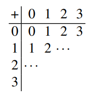
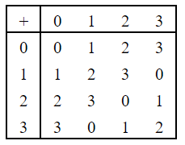
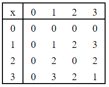
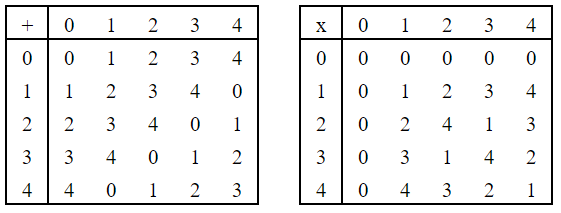
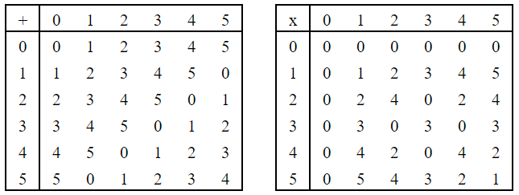

# Problem 5 (8 points)

Exercise 1.7 on p. 25-26.

---

**1.7.** We consider the ring $\mathbb{Z}_4$. Construct a table which describes the addition of all
elements in the ring with each other:

1. Construct the multiplication table for $\mathbb{Z}_4$.
2. Construct the addition and multiplication tables for $\mathbb{Z}_5$.
3. Construct the addition and multiplication tables for $\mathbb{Z}_6$.
4. There are elements in $\mathbb{Z}_4$ and $\mathbb{Z}_6$ without a multiplicative inverse. Which elements are these? Why does a multiplicative inverse exist for all nonzero elements in $\mathbb{Z}_5$?

### Solution

1.

2.

3.

4. In $\mathbb{Z}_4$, the elements without a multiplicative inverse are 0 and 2. In $\mathbb{Z}_6$, they are 2, 3, and 4. A multiplicative inverse exists for all nonzero elements in $\mathbb{Z}_5$ because 5 is a prime number, so the base of the integer ring does not share a common denominator other than 1 with any of its members.